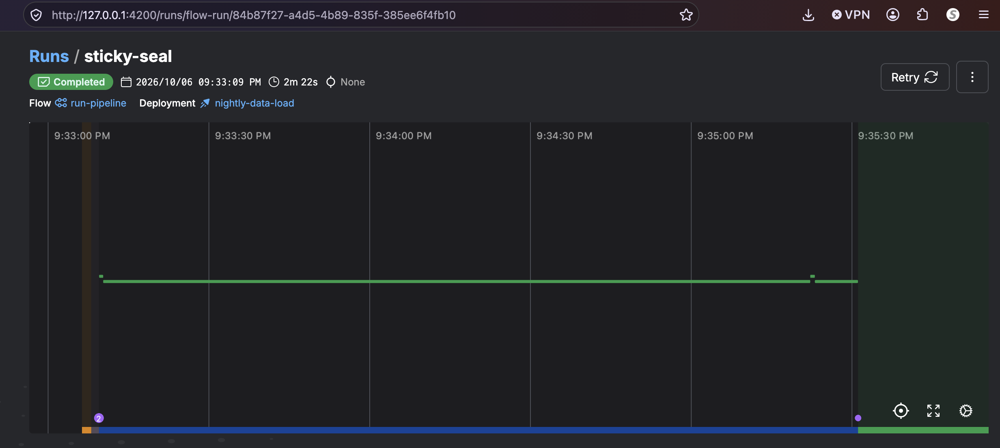
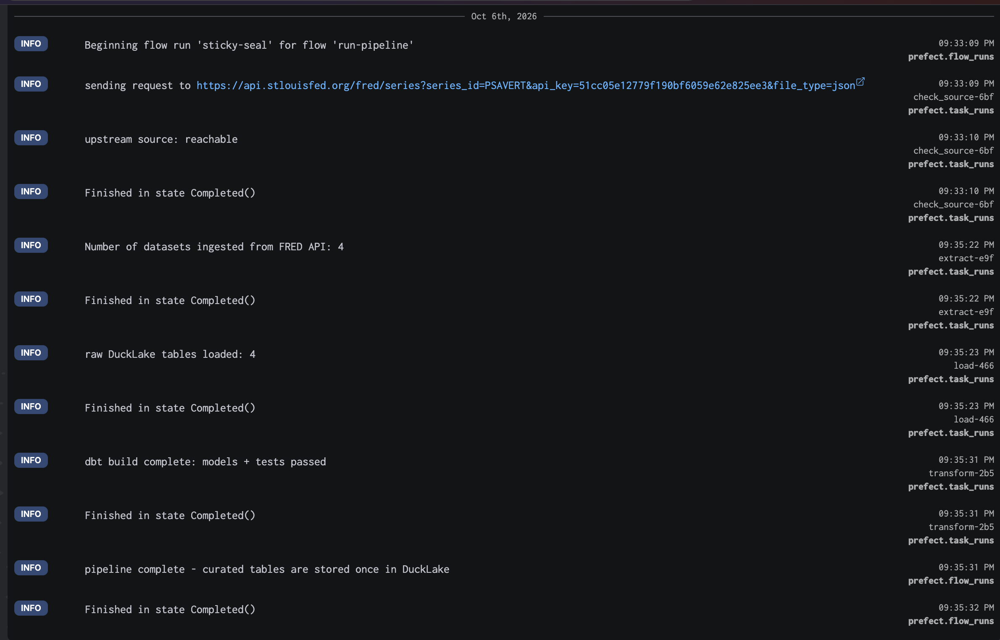
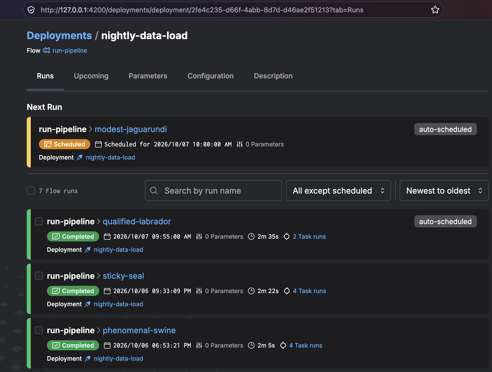
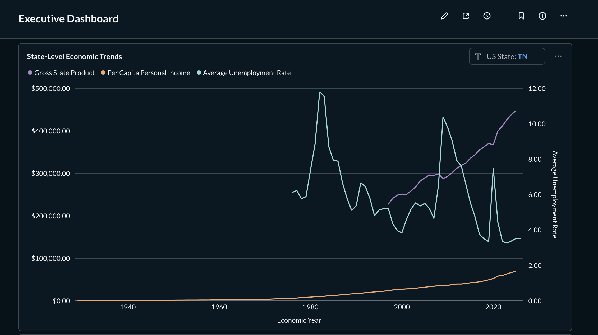
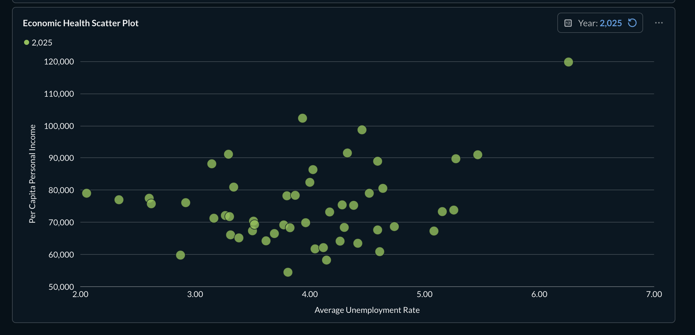

# US Financial Health Data Pipeline

## About this project:
This project ingests annual state-level economic indicator data (unemployment rates, per capita personal income, and gross state product) and aims to answer the following questions:

- What can these economic indicators tell us about how an individual US state's economy is trending over time?
- How are personal income and state unemployment rate related across all US states?

## Project design decisions:

**Source**: The FRED API. FRED stands for Federal Reserve Economic Data. FRED contains frequently updated US macro and regional economic time series at annual, quarterly, monthly, weekly, and daily frequencies. FRED aggregates economic data from a variety of sources- most of which are US government agencies.

**Raw landing location**: RustFS (S3-compatible storage) - source data will be stored here unmodified. This retention is important so that we have an immutable, exact record of source data before any business logic or cleaning is applied.

**Analytical store**: DuckLake - the flexibility of a data lake combined with the query performance of a data warehouse. This hybrid situation provides the benefits of a Postgres scenario (where the concurrent read/write problem completely disappears) while maintaining the performance advantages of DuckDB.

**Transform + orchestration**: dbt + Prefect

**Serving layer**: Metabase; acts as an intuitive, fast, and lightweight interface that turns raw stored data into accessible business intelligence.

## Architecture diagram

```text
                         FRED API
                              |
                              v
                     Prefect + Python
                              |
                              v
                raw JSON landing files (S3)
                              |
                              v
                    DuckDB execution engine
                       /              \
                      /                \
             PostgreSQL catalog       RustFS
             DuckLake metadata    Parquet data
                      \                    /
                       \                  /
                        +---- DuckLake -----+
                                  |
                                 dbt
                                  |
                          staging + marts
                                  |
                                  v
                              Metabase
```

## Start PostgreSQL + RustFS + Metabase

Copy the environment template:

```bash
cp .env.example .env
```

Review `.env` and change/add credentials when appropriate.

Start the infrastructure:

```bash
docker compose up -d --build
```

Services:

- PostgreSQL catalog: `localhost:5432`
- RustFS S3 API: `localhost:9000`
- RustFS console: `http://localhost:9001`
- Metabase: `http://localhost:3000`

The RustFS bucket initializer creates `${S3_BUCKET}` if it does not already exist.

## Scheduling

The pipeline was configured as a scheduled Prefect deployment.

The scheduled flow:

    nightly-data-load

runs automatically according to its configured cron schedule.

Scheduling removes the need for manual execution and allows the platform to operate continuously.

Example Prefect run:



Logs of prior Prefect runs (including 1 scheduled):


## Run the pipeline

The project expects the `.env` values in the shell environment when running Python/dbt on the host:

```bash
set -a
source .env
set +a

# Sync the Python environment
uv sync

# Start the Prefect server
uv run prefect server start

# Configure the local Prefect API
uv run prefect config set PREFECT_API_URL=http://127.0.0.1:4200/api

# Run the full flow
uv run python -m pipeline.flow
```


Or run the stages separately (no orchestration):

```bash
uv run python -m pipeline.extract_api
uv run python -c "from pipeline.steps import load_raw; print(load_raw())"
uv run dbt build
```

A successful run completes the full process:

-   source data ingestion from FRED API
-   raw data loading into S3
-   data transfer to DuckLake architecture
-   full dbt build: model materialization, testing, snapshots

## DuckLake catalog and RustFS storage

The pipeline attaches the lake roughly as:

```sql
ATTACH 'ducklake:postgres:dbname=ducklake_catalog host=localhost port=5432 user=ducklake password=...'
AS lake
(DATA_PATH 's3://feddatapipeline/', DATA_INLINING_ROW_LIMIT 0);
```

The exact credentials are supplied from `.env` / environment variables rather than committed to the repository.

DuckLake stores catalog metadata in PostgreSQL and table data as Parquet objects under the RustFS S3 path. 

## dbt configuration

`profiles.yml` uses `dbt-duckdb` with:

- DuckLake, PostgreSQL, and `httpfs` extensions
- an S3 secret for RustFS
- a PostgreSQL-backed DuckLake attachment
- `threads: 1` to avoid concurrent DuckLake write contention

## Metabase

Metabase runs in Docker with the community DuckDB driver. The current driver supports DuckLake, and for an external catalog such as PostgreSQL its documentation recommends putting the extension loading, secrets, `ATTACH`, and `search_path` in the **Init SQL** connection field so every pooled DuckDB connection receives the same setup. This init SQL script is provided in this repo as metabase/ducklake-init.sql.template. 

### Initial Metabase setup

1. Open `http://localhost:3000` and complete Metabase's first-time setup.
2. Choose **DuckDB** as the database type.
3. For database file, type :memory:
4. In the "Init SQL" field, paste the contents of metabase/ducklake-init.sql.template. The Init SQL must run on every new connection because Metabase maintains a connection pool. 

The final Executive Dashboard can be found at http://localhost:3000/dashboard/2-executive-dashboard (also included in the dbt project as an exposure in models/dashboard.yml)




## Project files

- `pipeline/extract_api.py` - live HTTP extraction from FRED API
- `pipeline/lake.py` - DuckLake/PostgreSQL/RustFS connection setup
- `pipeline/steps.py` - raw loading and dbt invocation
- `pipeline/flow.py` - Prefect orchestration
- `profiles.yml` - dbt DuckLake profile
- `docker-compose.yml` - PostgreSQL, RustFS, bucket initialization, and Metabase
- `metabase/Dockerfile` - Metabase + DuckDB community driver
- `metabase/ducklake-init.sql.template` - Metabase external-catalog connection setup

## Reset the local stack

To stop containers but retain PostgreSQL catalog, RustFS objects, and Metabase configuration:

```bash
docker compose down
```

To completely reset the local lakehouse state:

```bash
docker compose down --volumes
```

That removes the PostgreSQL catalog, RustFS Parquet objects, and Metabase application database.

# Lessons learned
The most challenging part of this project was debugging failures; this required a deep understanding of each step of the data flow, and how each step connects to the previous step and the subsequent step. I encountered an issue where I had defined conflicting values for the location of the DuckLake parquet files, so some parts of the pipeline were expecting these files to be in S3 and other parts were reading them from local storage. Standardizing this location was a great exercise in understanding how all the pieces of architecture fit together in this project.

# Future directions
This project could benefit from more advanced data visualizations, such as the following:

- Interactive Geospatial Mapping: Add a dynamic choropleth map, allowing users to toggle between absolute values, per-capita metrics, and year-over-year growth rates.

- Temporal Playback (Time-Lapse): Implement a "play" button on the dashboard that shows the changing economic health map of the United States over the last 20 years, clearly visualizing major recessions and recoveries.
